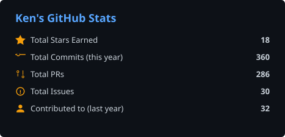
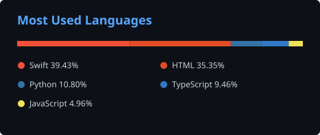
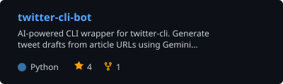
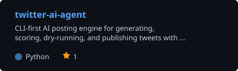
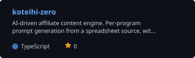
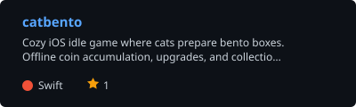

<div align="center">


<br>

<a href="https://github.com/Kensuke-sam">
  
</a>

<br>


<br><br>

**`The edge is not in typing everything by hand.`**<br>
**`It is in directing AI well and shipping things that work.`**

<br>

</div>

---

## About

```bash
$ whoami
Kensuke / Tokyo / Toyo Univ. (INIAD)

$ current-mode
Python / TypeScript dev building AI-powered tools

$ mission
Ship small, practical tools before momentum is lost
```

<table>
<tr>
<td width="60" align="center">🤖</td>
<td>Uses <strong>AI for prototyping and debugging</strong>, while owning architecture, feature design, and final review.</td>
</tr>
<tr>
<td align="center">🚢</td>
<td>Focused on <strong>shipping practical products</strong>, automation, and short feedback loops.</td>
</tr>
<tr>
<td align="center">⚙️</td>
<td>Drawn to <strong>lightweight tools and micro-products</strong> that reduce friction and solve specific problems.</td>
</tr>
</table>

---

## 📊 Dashboard

<div align="center">

<a href="https://github.com/Kensuke-sam">
  
</a>
<a href="https://github.com/Kensuke-sam?tab=repositories">
  
</a>

</div>

---

## 🛠️ Tech Stack

<div align="center">

### Core

<a href="https://skillicons.dev">
  
</a>

<br><br>

### AI-Assisted Development


<br><br>

`Python / TypeScript / Swift / Rust / GDScript` · `Git / GitHub` · `Claude Code / Codex / ChatGPT / Gemini` · `rapid prototyping` · `automation`

</div>

---

## 📦 Featured Work

<div align="center">

<a href="https://github.com/Kensuke-sam/twitter-cli-bot">
  
</a>
<a href="https://github.com/Kensuke-sam/twitter-ai-agent">
  
</a>
<a href="https://github.com/Kensuke-sam/koteihi-zero">
  
</a>
<a href="https://github.com/Kensuke-sam/catbento">
  
</a>

</div>

| Project | Description |
|---------|-------------|
| **[`twitter-cli-bot`](https://github.com/Kensuke-sam/twitter-cli-bot)** | CLI tool that turns article URLs into draft posts with Gemini, Claude, or Codex. Built for faster content workflows without a Twitter API key. Python. |
| **[`twitter-ai-agent`](https://github.com/Kensuke-sam/twitter-ai-agent)** | CLI-first AI-assisted posting engine for X / Twitter with dry-run safety, lightweight scoring, history tracking, and separate execution and decision layers. Python. |
| **[`koteihi-zero`](https://github.com/Kensuke-sam/koteihi-zero)** | Affiliate content engine that generates per-program article prompts from a single spreadsheet source. Tracks article freshness, offer health, and HTML safety with weekly automated checks. TypeScript. |
| **[`catbento`](https://github.com/Kensuke-sam/catbento)** | Cozy iOS idle game where cats make bento boxes. SwiftUI + SpriteKit, offline coin accumulation, upgrade and collection systems. Swift. |
| **`Micro tools`** | Small scripts and utilities built to automate repetitive tasks and reduce friction in my own workflow. |

---

## 🧰 AI Micro-Tools — 10 small web tools

Ten small AI-assisted web tools for everyday office work. All open in the browser — no signup, no API key required.

| Tool | What it does | Live |
|---|---|---|
| **[ai-meeting-tasker](https://github.com/Kensuke-sam/ai-meeting-tasker)** | Turns meeting minutes into a Markdown task list with owners & due dates | [open ↗](https://ai-meeting-tasker.vercel.app) |
| **[ai-work-prompt-builder](https://github.com/Kensuke-sam/ai-work-prompt-builder)** | Generates role-specific AI prompts for 10 common office tasks | [open ↗](https://ai-work-prompt-builder.vercel.app) |
| **[ai-daily-report-maker](https://github.com/Kensuke-sam/ai-daily-report-maker)** | Converts raw work logs into a structured daily report | [open ↗](https://ai-daily-report-maker.vercel.app) |
| **[ai-sales-memo-organizer](https://github.com/Kensuke-sam/ai-sales-memo-organizer)** | Cleans raw sales notes into a CRM-ready summary | [open ↗](https://ai-sales-memo-organizer.vercel.app) |
| **[ai-form-sheet-cleaner](https://github.com/Kensuke-sam/ai-form-sheet-cleaner)** | Parses free-text form responses into clean spreadsheet rows | [open ↗](https://ai-form-sheet-cleaner.vercel.app) |
| **[ai-job-posting-formatter](https://github.com/Kensuke-sam/ai-job-posting-formatter)** | Reformats job descriptions per channel (LinkedIn / Wantedly / etc.) | [open ↗](https://ai-job-posting-formatter.vercel.app) |
| **[ai-slack-polisher](https://github.com/Kensuke-sam/ai-slack-polisher)** | Polishes Slack drafts into clearer, team-friendly messages | [open ↗](https://ai-slack-polisher.vercel.app) |
| **[ai-pr-review-helper](https://github.com/Kensuke-sam/ai-pr-review-helper)** | Rewrites PR review comments to a consistent, kind tone | [open ↗](https://ai-pr-review-helper.vercel.app) |
| **[ai-faq-maker](https://github.com/Kensuke-sam/ai-faq-maker)** | Turns a list of inquiries into a clean FAQ document | [open ↗](https://ai-faq-maker.vercel.app) |
| **[ai-interview-next-action](https://github.com/Kensuke-sam/ai-interview-next-action)** | Extracts next actions from 1:1 / interview notes | [open ↗](https://ai-interview-next-action.vercel.app) |

Built with Next.js 15 + TypeScript + Tailwind. Each tool ships with a simple landing page.

---

## 🚀 Current Focus

<div align="center">

|  | Focus |
|:---:|:---|
| 🔬 | AI-assisted tools for information work: review, fact-checking, and summarization |
| 🔄 | Solo workflows that combine prompting, coding, and automation |
| ⚡ | Small products with short build cycles, clear scope, and practical utility |
| 🎯 | Growing at the overlap of AI-assisted development, software engineering, and startup thinking |

</div>

<br>


<br>

## 日本語での紹介

東洋大学 INIAD に通う Kensuke です。Python / TypeScript を中心に、AI を組み合わせた開発をしています。
「思いついたらすぐ作る」を大事に、小さくても実際に使えるツールを作っています。

AI 業務系の小ツールも 10 本公開しています（議事録 → タスク化 / 日報作成 / 営業メモ整理 など）。

<br>

<div align="center">

**Writing code, shipping things, and figuring it out as I go.**

<br><br>

<a href="https://github.com/Kensuke-sam">
  
</a>

</div>
